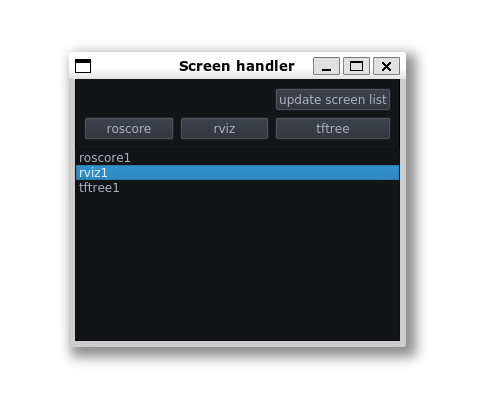
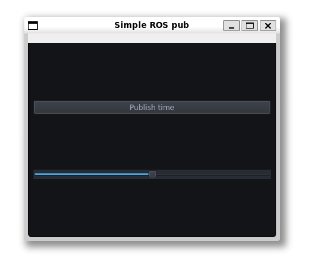

# pyqt-template
Some GUI script for getting started with PyQt

## `openscreens.py`

Opens and executes some `screen` commands, e.g:
``` r
screen -m -d -S rviz1 bash -c 'rosrun rviz rviz'
```

https://github.com/szenergy/demo_shell_scipts



## `publish_ros2.py`

